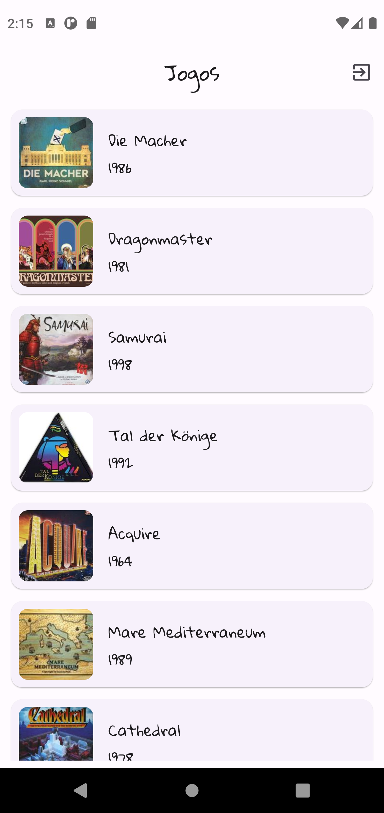
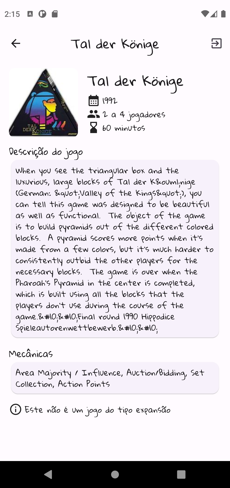
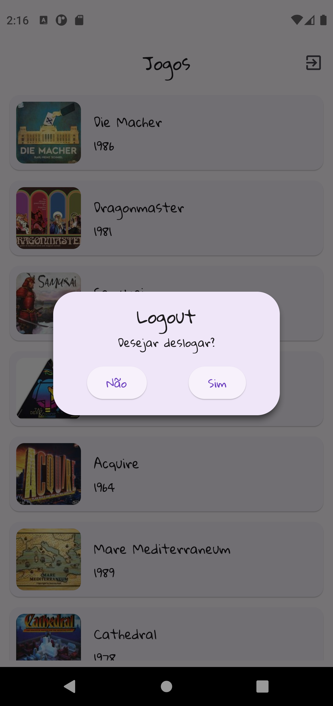

# Tabuleiro

## Descrição do Projeto

Este projeto foi desenvolvido como teste para seleção de bolsista na startup Tabulero. O objetivo do projeto é exibir informações detalhadas sobre jogos de tabuleiro. Os usuários podem realizar login no aplicativo com seu e-mail e senha para utilizar seus recursos.

## Tecnologias utilizadas

- Flutter
- Dart
- GetX

## Plataformas Suportadas

- Dispositivos Android
- Navegador Google Chrome

## Funcionalidades

- Realizar login com e-mail e senha.
- Exibir lista de jogos de tabuleiro.
- Carregar mais jogos na lista.
- Ver detalhes de um jogo selecionado.

## Credenciais de Teste

Para testar o projeto, utilize as seguintes credenciais:

- E-mail: candidato@tabulero.com.br
- Senha: 123456

## Desenvolvimento

O sistema foi desenvolvido utilizando a linguagem de programação Dart e o framework Flutter, com a biblioteca GetX para gerenciamento de estados. Durante o processo de desenvolvimento, foram aplicadas boas práticas de programação para desenvolver um código limpo, organizado e escalável. 

O aplicativo Tabuleiro foi projetado para dispositivos Android e também é compatível com o navegador Google Chrome, permitindo aos usuários desfrutar da experiência tanto em seus dispositivos móveis quanto em seus computadores pessoais. O layout responsivo garante que o aplicativo se adapte perfeitamente a diferentes tamanhos de tela.

##Screenshots

    
     &nbsp;&nbsp;&nbsp;
    

    
     &nbsp;&nbsp;&nbsp;
    

## Demonstração

## Autor
   Feito por: [@daricesousa](https://www.github.com/daricesousa)
